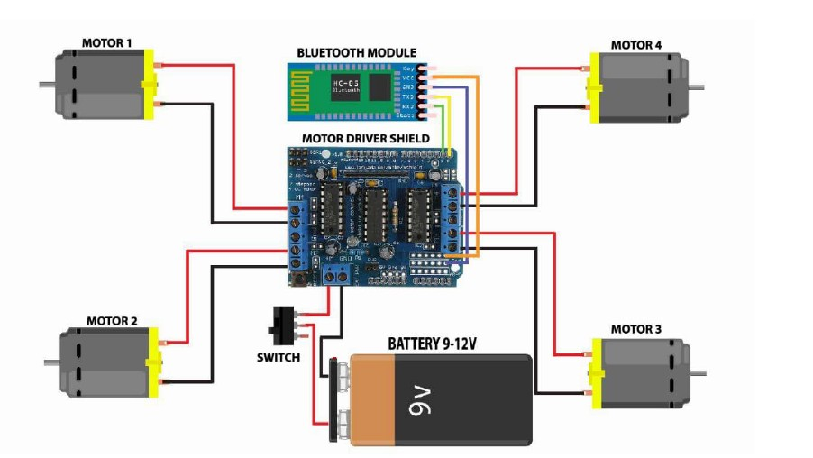

# War Field Surveillance Robot

This project demonstrates a war field surveillance robot designed for remote monitoring and control using Android devices via Bluetooth (HC-05). Built on Arduino Uno and motor driver modules, the robot can navigate and perform basic movements in a remote environment.

## 🔧 Key Features

- **Arduino Uno-based control system**
- **Bluetooth (HC-05) module** for wireless communication with Android
- **Motor driver (L293D)** to control movement of DC motors
- **Night vision camera support** (IP-based) for real-time surveillance
- **Python backend script** to simulate/control communication via serial port

## 🧠 Skills Demonstrated

- Embedded systems programming (Arduino)
- Serial communication using Python (`pyserial`)
- Backend logic for hardware interaction
- IoT device control
- Integration of hardware and software modules
---
## 🔌 Circuit Diagram

## 📁 Project Structure
war-field-robot/
│
├── backend/
│ └── control.py 
│
├── hardware/
│ └── war_robot.ino 
│
├── docs/
│ └── circuit_diagram.jpg

